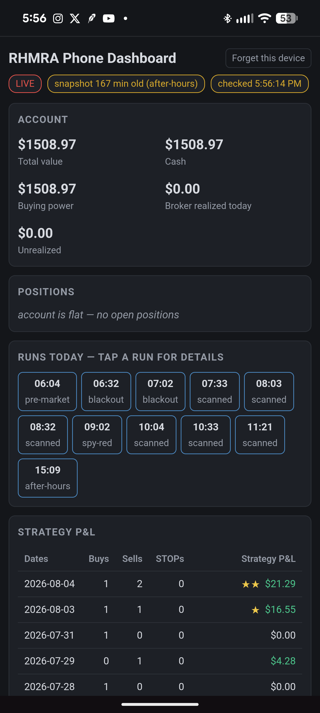

# RHMRA Phone Dashboard

RHMRA Phone Dashboard is an installable, read-only Progressive Web App for viewing an encrypted RHMRA dashboard on Android or iOS. It is a static site: there is no RHMRA account server, shared financial-data backend, or laptop web server. A separate maintainer-operated OAuth relay handles only the companion Agent's laptop token exchanges; it never receives dashboard data.

<p align="center">
  <a href="https://abiemann.github.io/RobinhoodEquityTradingDashboardViewer/" title="Source: https://github.com/abiemann/RobinhoodEquityTradingDashboardViewer">
    
  </a>
</p>

**Normal setup starts on the laptop:** open the RHMRA dashboard, select **View on Phone**, create the QR code, and scan it with the phone's camera.

The laptop uploader writes one encrypted JSON envelope to the user's Google Drive `appDataFolder`. The PWA polls that hidden app-data file directly from the browser and decrypts it locally. Google provides the user's private online data box; the user does not need to create or administer a bucket.

## What the end user needs

An end user needs only:

- the RHMRA laptop dashboard with **View on Phone**;
- a phone camera plus Chrome (Android) or Safari (iPhone/iPad); and
- a free Google account.

The **View on Phone** QR code carries the public viewer address and private pairing fragment, so normal setup does not require the user to find or type a web address. The direct public URL and **Copy private link** provide an alternate approach when QR scanning is unavailable.

End users do **not** need GitHub, a Cloudflare account, a Google Cloud project, a web server, or an Android/iOS developer account. The maintainer configures Google OAuth and the laptop token relay once for everyone. Users simply sign in to Google and approve access to this app's hidden Drive data folder.

## Install and pair (Android and iOS)

### Recommended: scan the QR code from the laptop dashboard

Start from the RHMRA dashboard running on the laptop. This is the normal setup path:

1. On the laptop dashboard, select **View on Phone**.
2. Choose the share duration, then select **Pair phone and create QR code**.
3. Scan the displayed QR code with the phone's camera.
4. If Messenger, Instagram, or another app opens the link in its built-in browser, use the RHMRA handoff screen to open it in **Chrome** (Android) or **Safari** (iPhone/iPad). Do not pair inside an embedded browser.
5. Install RHMRA from Chrome or Safari if it is not already installed, then open it from the phone's Home Screen.
6. Tap **Connect Google Drive** and sign in with the same Google account used by the laptop uploader. The encrypted dashboard will appear after the first successful refresh.

On iPhone and iPad, Safari and the installed Home Screen app keep separate private storage. Install RHMRA before pairing. If scanning the QR code opens Safari instead of the installed app, use the alternate approach below to paste the private pairing link inside the installed RHMRA app.

### Alternate: install first and paste the private link

Use this approach if the phone cannot scan the QR code or the camera does not open the installed RHMRA app. Install the PWA before pairing so the key is saved in the installed app's own storage:

1. On the phone, open [RHMRA Phone Dashboard](https://abiemann.github.io/RobinhoodEquityTradingDashboardViewer/).
   - If Messenger, Instagram, or another app opens the link in its built-in browser, use the RHMRA handoff screen to open it in **Chrome** (Android) or **Safari** (iPhone/iPad). Do not pair inside an embedded browser.
2. Install it:
   - **Android / Chrome:** browser menu -> **Install app** or **Add to Home screen**.
   - **iPhone / Safari:** Share -> **Add to Home Screen**.
3. Open **RHMRA** from the phone's Home Screen.
4. On the laptop dashboard, select **View on Phone**, create the secure share, and choose **Copy private link**.
5. Transfer that private link to the phone using a trusted method, copy it, and tap **Paste private pairing link** inside the installed PWA.
6. Tap **Connect Google Drive** and sign in with the same Google account used by the laptop uploader.

The dashboard QR flow is the recommended approach; the public URL and copied private link provide the alternate approach. Never post or forward the QR code or private link: it contains the dashboard decryption key.

To prevent an easy-to-miss pairing in the wrong storage container, the viewer disables pairing when it detects a known in-app browser or an iPhone/iPad running outside Home Screen/standalone mode. A website cannot force every social app to launch the system browser, so the handoff provides a best-effort **Open in Chrome** action plus a public-link copy fallback and manual Chrome/Safari instructions. The private pairing fragment is never forwarded during this handoff. Open the installed RHMRA app and pair there.

The pairing survives future laptop sessions. The laptop must reuse the same `share_id` and key, update the same Drive file, and advance `sequence`. Phone Google access tokens deliberately stay in browser memory. After an app relaunch or token expiry, a previously verified pairing shows **Resume Google Drive**; that user gesture obtains a new short-lived token while reusing the existing Google grant, so consent is requested again only if the grant is missing or was revoked. A reload can immediately restore the last verified dashboard from the original AES-GCM encrypted envelope saved in the pairing record; on the phone, the decrypted payload and Google access token are never persisted.

The phone PWA signs in and accesses Drive directly from the browser; phone tokens never pass through the laptop OAuth relay. The companion Agent uses that stateless Cloudflare Worker only to forward the laptop's one-time authorization code and S256 PKCE verifier, or a later refresh token, to Google's fixed token endpoint and return Google's token response. The Worker code does not log or store those values and receives no dashboard snapshots, Drive files, pairing keys, brokerage credentials, or trading data. On Windows, the Agent stores its Google tokens locally as current-user DPAPI ciphertext.

## How it works

1. The laptop captures a strict, read-only dashboard field allowlist.
2. It encrypts the payload with AES-256-GCM and uploads the envelope to Google Drive's hidden `appDataFolder`.
3. **View on Phone** encodes a private pairing link in the QR code. That link supplies the share identifier and AES key in a URL fragment:

   ```text
   #v=2&provider=gdrive&id=<share_id>&key=<base64url-key>
   ```

4. The PWA removes the fragment from the address bar before its first asynchronous operation, imports the key as a non-extractable Web Crypto key, and persists it in IndexedDB where supported.
5. While visible, the PWA polls Google Drive every 30 seconds, validates the envelope and payload, rejects rollback/equivocation, decrypts locally, and renders with safe DOM text APIs. After successful verification, it retains the original AES-GCM encrypted envelope in the pairing record so a reload can restore the last verified view without storing dashboard plaintext.
6. When backgrounded, polling stops. Returning to the app triggers an immediate refresh.

Successful foreground refreshes remain on a 30-second schedule. Google Drive `429` and `5xx` responses use bounded exponential retry with jitter, honor `Retry-After`, and cap the delay at five minutes. A successful request or return to the foreground resets that backoff.

The service worker caches only the static application shell. It never caches Google API responses, OAuth tokens, encrypted envelopes, or decrypted dashboard data. The last verified AES-GCM encrypted envelope is stored only in the local pairing record and is removed when it expires, Google Drive confirms that sharing stopped, or the user selects **Forget this device**.

## Stop, disconnect, and forget

- **Stop sharing** on the laptop removes the active encrypted Drive snapshot and stops uploads, but keeps the laptop and phone pairing for a later session.
- **Disconnect Google Drive** on the laptop requests Google revocation, then clears the Agent's in-memory Google credential and locally saved DPAPI-protected credential whether or not Google confirms the remote revocation. It keeps the phone pairing. Because the laptop and phone use the same Google application grant, the phone may need to select **Connect Google Drive** again afterward.
- If the laptop reports that remote revocation could not be confirmed, remove RHMRA from [Google Account third-party connections](https://myaccount.google.com/connections) for immediate assurance. The Agent's local credential has already been cleared.
- Phone disconnect clears only the phone's in-memory access token. Phone **Forget this device** clears only that phone's pairing, cached encrypted envelope, decryption key, and in-memory token. Neither phone action requests Google revocation or clears the laptop Agent's credential.

## Maintainer setup (one time, not for end users)

The person publishing the PWA performs these steps once.

### 1. Create the Google application

In one Google Cloud project:

1. Enable the **Google Drive API**.
2. Configure the OAuth consent/branding screen with the exact app name **RHMRA Phone Dashboard** and provide the hosted [About](./about.html), [Privacy](./privacy.html), and [Terms](./terms.html) URLs.
3. Request only this scope:

   ```text
   https://www.googleapis.com/auth/drive.appdata
   ```

4. Create an OAuth client of type **Web application** for the PWA.
5. Add the static site's origin under **Authorized JavaScript origins**. For GitHub Pages that is normally:

   ```text
   https://abiemann.github.io
   ```

   Origins do not include the `/RobinhoodEquityTradingDashboardViewer/` path. Add localhost origins separately for local development when needed.
6. Create the laptop uploader's **Desktop app** OAuth client in the same Google Cloud project. Using the same project makes the web and desktop clients parts of the same Google application and gives them access to the same app-data space for a signed-in user. Its secret belongs only in the OAuth Worker's encrypted secret store; do not distribute it with the Agent or PWA.
7. In **Google Auth Platform -> Audience**, use **External** and select **Publish app** so the app is **In production** rather than limited to test users.
8. In **Branding**, confirm the support and developer contacts, then submit the public name, homepage, Privacy Policy, Terms of Use, and logo for brand verification.

### 2. Deploy the laptop OAuth relay

Deploy the stateless Cloudflare Worker from [`phone-share-oauth-broker`](https://github.com/abiemann/RobinhoodEquityTradingAgent/tree/main/phone-share-oauth-broker) once for the public Agent release. Store the Desktop client secret with Wrangler's encrypted Worker-secret command, run the Worker's tests, and pin the released Agent to the exact production HTTPS endpoint. Do not enable request-body logging, redirects, CORS, a database, KV, Durable Objects, or analytics payloads for this relay. End users neither deploy nor configure it.

The relay transiently receives the authorization code and S256 PKCE verifier or refresh token, then Google's token response. Cloudflare provides the network and execution infrastructure and processes that traffic and its network metadata as a service provider under Cloudflare's terms and privacy policy. The Worker must never receive dashboard snapshots, Drive files, pairing keys, brokerage credentials, or trading data.

### 3. Configure the public client ID

Edit [`config.js`](./config.js) and replace only:

```js
googleClientId: "REPLACE_WITH_GOOGLE_WEB_CLIENT_ID.apps.googleusercontent.com"
```

The web OAuth client ID is public configuration, not a password. Do not add an OAuth client secret, refresh token, access token, pairing key, or laptop credential to this repository.

### 4. Publish the static site

The repository includes a pinned GitHub Actions workflow that verifies the PWA and publishes only its static application allowlist. In **Settings -> Pages**, set **Source** to **GitHub Actions**. The workflow deploys automatically from `main`; a maintainer can also start it manually from **Actions -> Publish PWA to GitHub Pages** for a controlled prerelease. It refuses to publish while `config.js` still contains the placeholder Google client ID.

All URLs, the manifest, and the service-worker scope are relative, so the project URL `https://abiemann.github.io/RobinhoodEquityTradingDashboardViewer/` is supported. After deployment, confirm:

- the dashboard loads at the project URL;
- `about.html` is public and accurately describes the app;
- `privacy.html` is public;
- `terms.html` is public;
- the browser reports the site as installable; and
- the OAuth web client's authorized origin matches the deployed origin exactly.

Only the maintainer performs these steps. A user of the published PWA sees only Google sign-in/consent.

### 5. Public-release checklist

Before releasing **View on Phone** QR pairing to end users:

- set the OAuth audience to **External / In production** rather than leaving it limited to test users;
- verify the exact app name **RHMRA Phone Dashboard**, support contact, developer contact, homepage, hosted privacy URL, hosted terms URL, logo, and any authorized domains shown by Google;
- confirm the only requested Drive scope is https://www.googleapis.com/auth/drive.appdata;
- display the Google Drive purpose and Limited Use disclosure before the user starts OAuth, and publish clear deletion and revocation instructions;
- for verified public branding, serve the app from a custom domain you control, verify DNS ownership in Google Search Console, and add that domain to Google Auth Platform;
- confirm the Web and Desktop OAuth clients are in the same project, put only the Web client ID in this repository, and pin the Agent's public Desktop client ID and exact production relay URL;
- keep the Desktop client secret only in the Worker's encrypted secret store, confirm OAuth request/response bodies are not logged or persisted, and test initial exchange plus refresh through the production relay;
- make the Web client's Authorized JavaScript origin exactly match the production origin (scheme and host, with no repository path or trailing path);
- remove production dependence on localhost/test clients and make sure no OAuth client secret, access token, refresh token, pairing key, or `.env` file is committed;
- test a brand-new pairing end to end with a non-maintainer Google account on both Android and iOS, beginning with laptop **View on Phone -> Pair phone and create QR code -> scan**, and covering install, sign-in, foreground polling, expiry, Stop, and **Forget this device**;
- test the direct public URL plus **Copy private link** as the documented alternate approach when QR scanning cannot complete;
- test laptop **Disconnect Google Drive** with confirmed and unconfirmed Google revocation, verify the DPAPI-backed credential is removed in both cases, confirm pairing remains, and reconnect the phone if the shared Google grant was revoked;
- test Google-grant removal and reconnection so the recovery instructions are accurate; and
- publish the privacy and security documents before requesting OAuth approval or verification.

## Laptop uploader contract

The uploader must authenticate to Drive with the desktop OAuth client from the same Cloud project and request only `drive.appdata`. It must create or update exactly one file in `appDataFolder` named:

```text
rhmra-phone-v2-<share_id>.json
```

The released Agent sends the one-time Google authorization code plus S256 PKCE verifier, or a refresh token, to the exact pinned OAuth relay endpoint. The relay adds the protected Desktop client credential, forwards only the allow-listed form to Google's fixed HTTPS token endpoint, validates Google's token response, and returns it without application logging or persistence. On Windows, the Agent stores access and refresh tokens below local application data only as ciphertext protected for the current user with DPAPI; other platforms keep them only in process memory until an equivalent native store is supported.

The PWA queries that exact name with `trashed = false` and fails closed if duplicates exist. Once discovered, the Drive file ID is retained locally and reused.

Use a stable 32-byte AES key and stable 22-64 character base64url `share_id` across laptop sessions. Never reset or reuse a sequence number for different content. Each accepted update must have a higher safe-integer `sequence` and a nondecreasing `captured_at`. A higher sequence may extend `expires_at`; changing content or expiry at the same sequence is rejected as equivocation.

The envelope has exactly these fields:

```json
{
  "schema_version": 1,
  "share_id": "...",
  "sequence": 1,
  "captured_at": "2026-08-03T12:00:00.000Z",
  "expires_at": "2026-08-03T14:00:00.000Z",
  "iv": "<12-byte-base64url>",
  "ciphertext": "<AES-GCM-ciphertext-base64url>"
}
```

AES-GCM additional authenticated data is the UTF-8 encoding of:

```js
JSON.stringify([schema_version, share_id, sequence, captured_at, expires_at])
```

The decrypted payload schema is validated strictly by [`src/protocol.js`](./src/protocol.js). Schema version 1 accepts the original legacy shape and one coordinated enhanced shape. Enhanced payloads add `pnl_reconciliation` plus `realized_pnl_cents` and `pnl_quality` on every rules-era row. Integer cents are the display authority. Reconciliation counts enforce `0 <= matched_fill_count <= available_fill_count <= realized_fill_count`; incomplete or estimated comparisons must use `qualified`, while fully matched comparisons use `agrees` only for a zero-cent difference and `difference` otherwise. The comparison is between broker telemetry and the strategy's ledger-fill basis—it does not claim tax-lot reconciliation, and equal broker/subtotal cents never imply agreement when any strategy fill is unavailable or unmatched. The payload contains only `mode`, the account summary/positions, runs, P&L comparison, and rules-era aggregates needed by the dashboard. Do not add raw ledgers, account/order identifiers, credentials, filesystem paths, constants, or arbitrary HTML.

The complete link encoded in the laptop's **View on Phone** QR code must append the exact fragment to the deployed PWA base URL. **Copy private link** exposes the same link for the manual alternate approach. The AES key belongs only in the fragment; never put it in a query string, file, API request, or log.

## Security and privacy

- Pairing keys stay on the paired device and are non-extractable where the browser supports CryptoKey cloning.
- A session-only fallback is used only when that non-extractable key cannot be cloned into IndexedDB.
- The pairing record may retain the last verified AES-GCM encrypted envelope until its authenticated expiry, a confirmed Stop, or **Forget this device**. It never retains the decrypted dashboard payload.
- Phone OAuth access tokens remain in browser memory and are never placed in IndexedDB, local storage, the service-worker cache, URLs, or the laptop relay.
- Laptop OAuth exchange values pass transiently through the Cloudflare Worker, whose code has no application persistence or token logging. On Windows, the Agent's local token copy is current-user DPAPI ciphertext; unsupported platforms retain it only in process memory.
- In the phone PWA, disconnect and **Forget this device** affect only phone-local state and deliberately do not revoke the shared Google application grant or clear the Agent's credential. This is distinct from laptop **Disconnect Google Drive**, which requests Google revocation and clears the Agent's local DPAPI-backed credential while retaining the phone pairing.
- The app rejects unknown fields, malformed sizes/timestamps, stale capture times, lower sequences, and same-sequence conflicts.
- A 401 requires reconnection. When laptop sharing stops and its Drive file disappears, the phone removes its cached encrypted envelope but keeps the stable pairing and polls for a replacement file with the exact same share name; a later laptop session resumes automatically. An expired share also discards its cached envelope while remaining paired so a later, higher sequence can safely revive it.
- UI rendering uses `textContent`/DOM nodes rather than HTML strings.
- The phone PWA has no analytics, advertisements, or developer-operated dashboard collection endpoint. The OAuth relay has no application analytics payload and never receives dashboard or Drive data.
- Google still receives the signed-in account identity and OAuth/Drive request metadata, including the Google application/client, request IP and device/browser information, hidden app-data filename/ID, ciphertext size, file timestamps, and request timing. Encryption protects the dashboard contents, not that metadata. Cloudflare processes the laptop token traffic and associated network/Worker metadata as the relay infrastructure provider. The static host sees ordinary page requests, but URL fragments containing pairing keys are not sent in HTTP requests.

See [About](./about.html), [Privacy](./privacy.html), [Terms](./terms.html), and [Security](./SECURITY.md) for details and limitations.

## Local development

No runtime dependencies or build step are required. Use Node.js 20 or newer for tests. The dependency-free `pnpm-lock.yaml` is intentionally kept so the package-manager format remains reproducible:

```powershell
npm run verify
```

Every push and pull request to `main` runs the same syntax and test checks in GitHub Actions without installing third-party packages.

Serve the repository root on localhost rather than opening `index.html` directly so ES modules and the service worker work correctly. For example:

```powershell
python -m http.server 8080
```

Then add `http://localhost:8080` to the web OAuth client's authorized JavaScript origins and open that address. Do not commit a real private pairing link or key in fixtures, screenshots, issues, or test output.

## License

MIT. See [`LICENSE`](./LICENSE).
